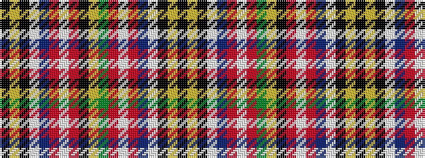

KYKWBRWRGYKRWRBWKYK

It is a 19 stripe tartan.

<figure class="pat-woven">

<figcaption>idealised sample</figcaption>
</figure>

## Colour Sequence



## Tartans with this colour sequence

| Tartans |
|---------------|
| [Wilson's, No 190](/variants/s19/k3ly2k13w2t11r12w2r12k12ly2g12r12w2r12t11w2k13ly2k3~x2/)|
||
