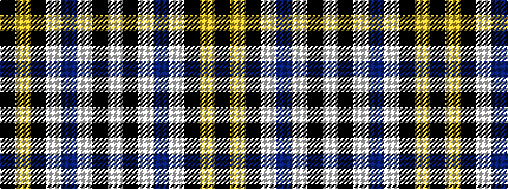

KYKWBWKW

It is a 8 stripe tartan.

<figure class="pat-woven">

<figcaption>idealised sample</figcaption>
</figure>

## Colour Sequence



## Tartans with this colour sequence

| Tartans |
|---------------|
| [Washington County Sheriff's Office](/variants/s8/lb6k6lb6b3w1k39lo3k3~x2/)|
||
