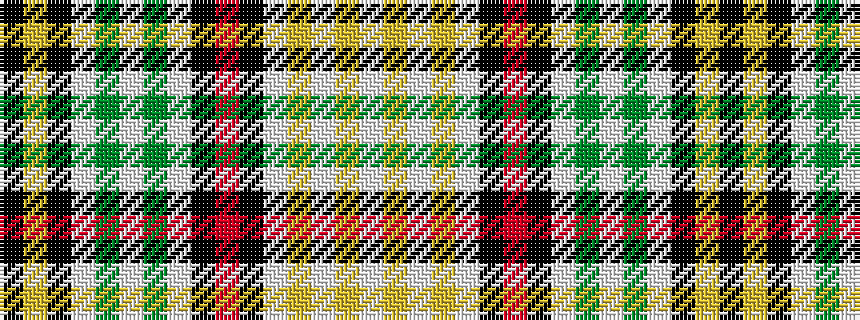

KYKWGWGWKRKWYWYW

It is a 16 stripe tartan.

<figure class="pat-woven">

<figcaption>idealised sample</figcaption>
</figure>

## Colour Sequence



## Tartans with this colour sequence

| Tartans |
|---------------|
| [Kinnison (Clan?)](/setts/s16/k17ly2k17w12g2w12g2w12k17r2k17w12ly2w12ly2w12~x2/)|
||
