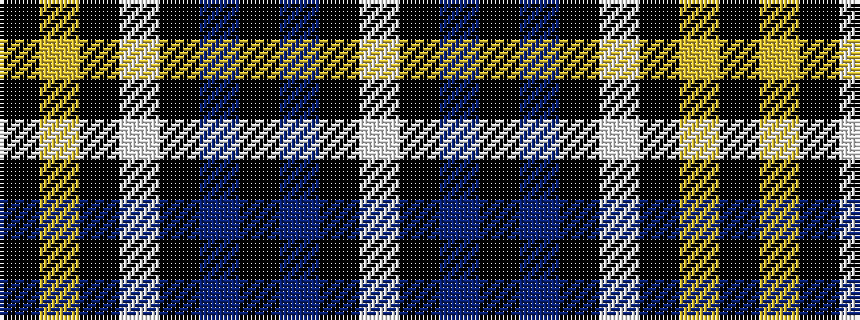

KYKWKBKBKW

It is a 10 stripe tartan.

<figure class="pat-woven">

<figcaption>idealised sample</figcaption>
</figure>

## Colour Sequence



## Tartans with this colour sequence

| Tartans |
|---------------|
| [Payne of Wallins Creek (Personal)](/setts/s10/w2k2dp8k10dp8k64w2k8ly1k1~x2/)|
||
