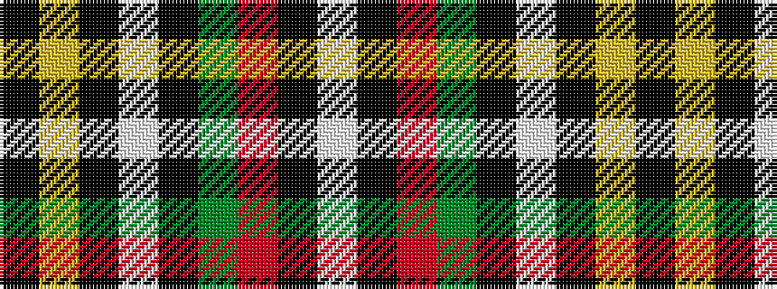

KYKWKGRKW

It is a 9 stripe tartan.

<figure class="pat-woven">

<figcaption>idealised sample</figcaption>
</figure>

## Colour Sequence



## Tartans with this colour sequence

| Tartans |
|---------------|
| [Hebrides](/setts/s9/k15ly2k2lb2k2dg10o6k3lb2~x2/)|
||
