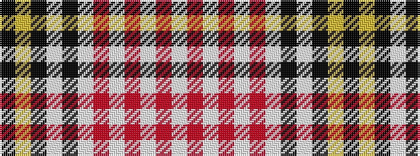

KYKWKWRWRWRW

It is a 12 stripe tartan.

<figure class="pat-woven">

<figcaption>idealised sample</figcaption>
</figure>

## Colour Sequence



## Tartans with this colour sequence

| Tartans |
|---------------|
| [Fish Hoek High School](/setts/s12/w20r5w5r81w5r5w20k5w5k60lo10k4/)|
||
