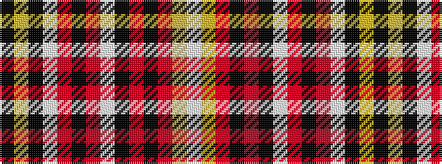

KYKWRKRWKRKRYW

It is a 14 stripe tartan.

<figure class="pat-woven">

<figcaption>idealised sample</figcaption>
</figure>

## Colour Sequence



## Tartans with this colour sequence

| Tartans |
|---------------|
| [Firefighters](/setts/s14/k91lo3k11w2r3k2r3w2k3r6k3r3lo3w3~x2/)|
||
