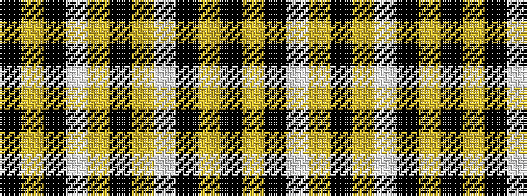

KYKWYKYWKYK

It is a 11 stripe tartan.

<figure class="pat-woven">

<figcaption>idealised sample</figcaption>
</figure>

## Colour Sequence



## Tartans with this colour sequence

| Tartans |
|---------------|
| [Oregon State University (Corporate)](/setts/s11/k6lo8k13w1lo11k1lo11w4k2lo1k2~x2/)|
||
