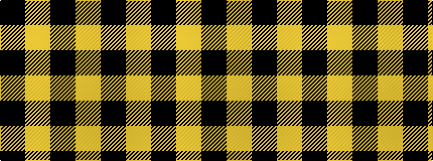

KYKY

It is a 4 stripe tartan.

<figure class="pat-woven">

<figcaption>idealised sample</figcaption>
</figure>

## Colour Sequence



## Tartans with this colour sequence

| Tartans |
|---------------|
| [Justus](/setts/s4/k5ly1k1~x12/)|
||
| [Justus #2 (Personal)](/setts/s4/k5lo1k1~x20/)|
||
| [MacFarlane VS](/tartans/k7lr6k1/)|
||
| [Raeburn](/setts/s4/k34ly3k34ly26~x2/)|
||
| [Raeburn](/setts/s4/k6ly1k6ly6~x6/)|
||
