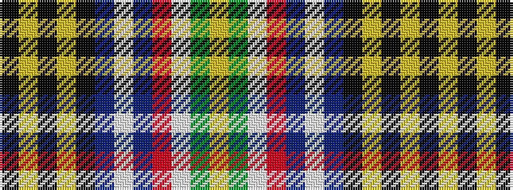

KYKYKBWBRWGY

It is a 12 stripe tartan.

<figure class="pat-woven">

<figcaption>idealised sample</figcaption>
</figure>

## Colour Sequence



## Tartans with this colour sequence

| Tartans |
|---------------|
| [Clan An Caigeann (Corporate)](/setts/s12/k44ly3k4ly3k4db4w2db4r2w2dg4ly2~x2/)|
||
