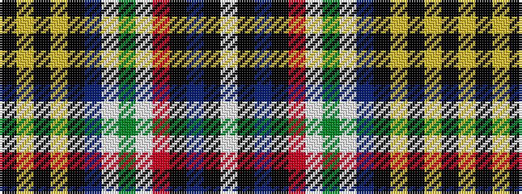

KYKYKBWGWRKBKW

It is a 14 stripe tartan.

<figure class="pat-woven">

<figcaption>idealised sample</figcaption>
</figure>

## Colour Sequence



## Tartans with this colour sequence

| Tartans |
|---------------|
| [South Africa](/setts/s14/w4k1db24k1r8w2dg8w2db8k1ly2k8ly2k1~x2/)|
||
