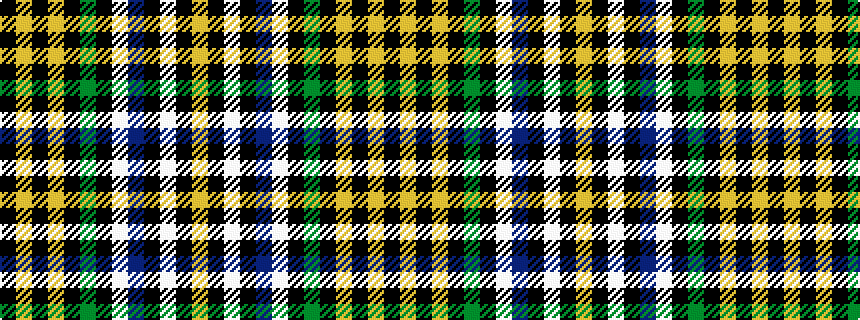

KYKYKGKWBKWKY

It is a 13 stripe tartan.

<figure class="pat-woven">

<figcaption>idealised sample</figcaption>
</figure>

## Colour Sequence



## Tartans with this colour sequence

| Tartans |
|---------------|
| [Lotus Elan (Corporate)](/variants/s13/k3ly4k3ly4k3g16k16w3b16k2w2k2ly2~x2/)|
||
