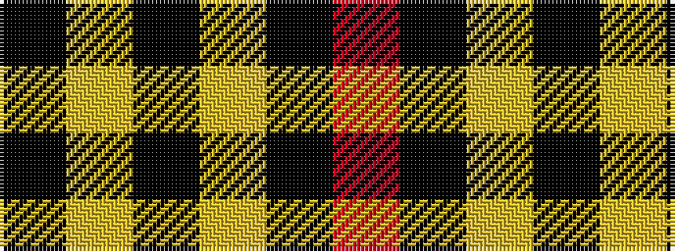

KYKYKR

It is a 6 stripe tartan.

<figure class="pat-woven">

<figcaption>idealised sample</figcaption>
</figure>

## Colour Sequence



## Tartans with this colour sequence

| Tartans |
|---------------|
| [Porter Drinkers', The](/setts/s6/k2ly6k2ly11k9r1~x2/)|
||
