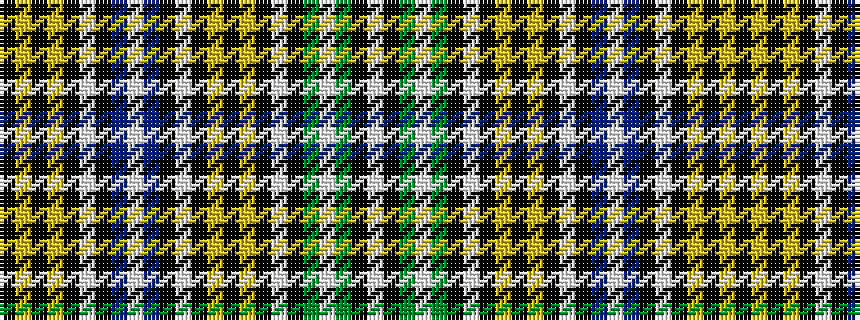

KYKYKWKBWBKWKYKYKWKGWGKW

It is a 24 stripe tartan.

<figure class="pat-woven">

<figcaption>idealised sample</figcaption>
</figure>

## Colour Sequence



## Tartans with this colour sequence

| Tartans |
|---------------|
| [Buchanan(Mtd)MacGregor Hastie V. Tartan](/variants/s24/lt3k1dg31lt3dg31k1lt4k1lo7k1lo7k1lt4k1dr31w3dr31k1lt4k1lo7k1lo7k1~x2/)|
||
