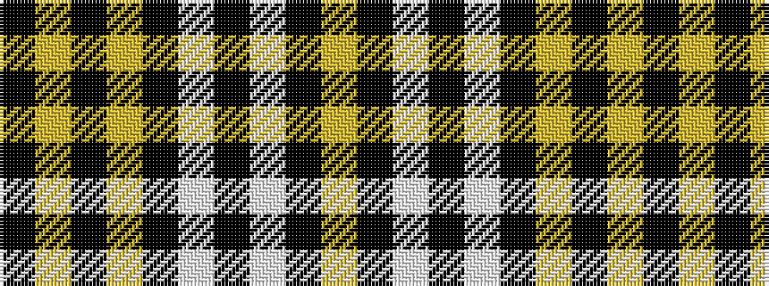

KYKYKWKWKY

It is a 10 stripe tartan.

<figure class="pat-woven">

<figcaption>idealised sample</figcaption>
</figure>

## Colour Sequence



## Tartans with this colour sequence

| Tartans |
|---------------|
| [Coppa Romana (Corporate)](/setts/s10/k17ly2k2ly2k9lb11k2lb11k20ly2~x2/)|
||
| [Coppa Romana (Switzerland)](/setts/s10/k17ly2k2ly2k9w11k2w11k20ly2~x2/)|
||
