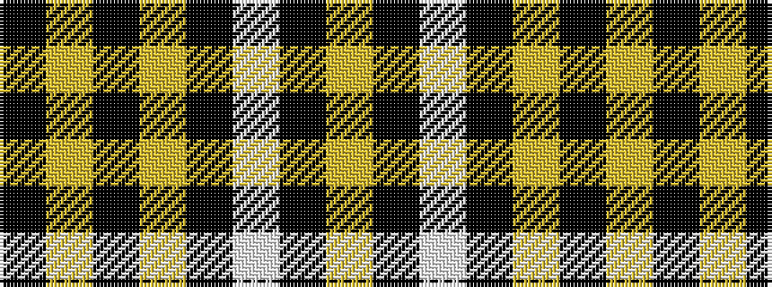

KYKYKWKY

It is a 8 stripe tartan.

<figure class="pat-woven">

<figcaption>idealised sample</figcaption>
</figure>

## Colour Sequence



## Tartans with this colour sequence

| Tartans |
|---------------|
| [Children's Wish Foundation of Canada](/setts/s8/ly5k2w16k5lg29k2ly2k2~x2/)|
||
