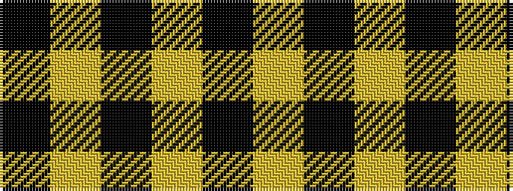

KYKYKY

It is a 6 stripe tartan.

<figure class="pat-woven">

<figcaption>idealised sample</figcaption>
</figure>

## Colour Sequence



## Tartans with this colour sequence

| Tartans |
|---------------|
| [Justus #2 (Personal)](/setts/s6/k5lo1k1lo1~x20/)|
||
| [Monoch Airline](/setts/s6/lo4k6lo1k1lo16k2~x2/)|
||
| [Schranz-Gritte (Corporate)](/setts/s6/lo24k5lo4k2lo3k2~x2/)|
||
