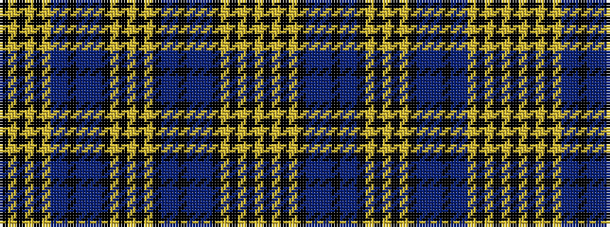

KYKYKYBBKBBBKYKYKYKBBKBBBKYKYKY

It is a 31 stripe tartan.

<figure class="pat-woven">

<figcaption>idealised sample</figcaption>
</figure>

## Colour Sequence



## Tartans with this colour sequence

| Tartans |
|---------------|
| [McLosek (Personal)](/setts/s31/lr8k1lr2k1lr2k8dp8t2dp1k2t2dp8k8lr8k2lr1k2lr8k8dp8t1dp2k1dp2t1lr8k8lr2k2lr1k2~x2/)|
||
