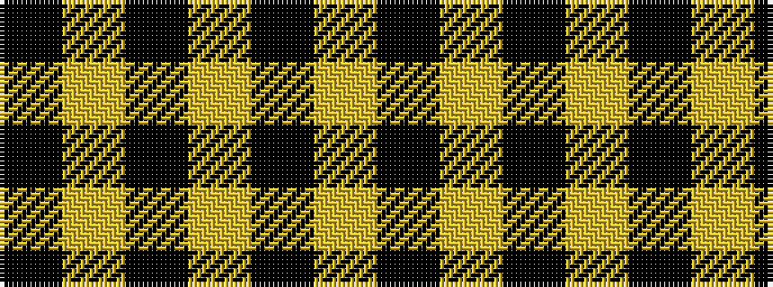

KYKYKYK

It is a 7 stripe tartan.

<figure class="pat-woven">

<figcaption>idealised sample</figcaption>
</figure>

## Colour Sequence



## Tartans with this colour sequence

| Tartans |
|---------------|
| [Kinloch Anderson Check (Fashion)](/setts/s7/k3lo18k12lo18k2lo2k3~x2/)|
||
