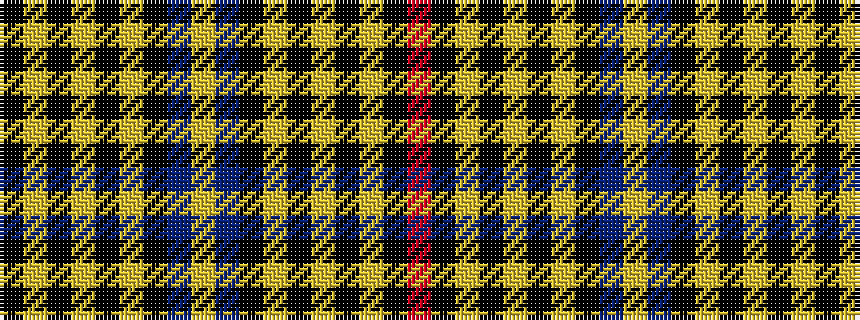

KYKYKYKBYBKYKYKYKR

It is a 18 stripe tartan.

<figure class="pat-woven">

<figcaption>idealised sample</figcaption>
</figure>

## Colour Sequence



## Tartans with this colour sequence

| Tartans |
|---------------|
| [Hanna of Stirlingshire](/setts/s18/k1lr2k2lr2k1lr4k1db9lo1db9k1lr4k1lr2k2lr2k1r1~x4/)|
||
