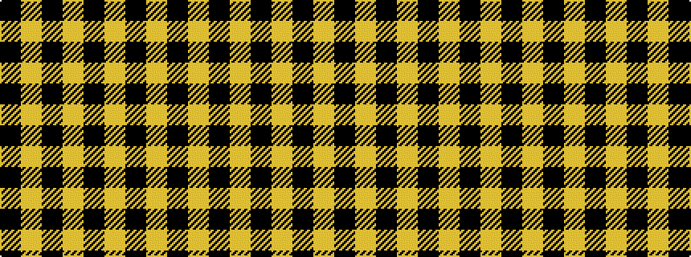

KYKYKYKY

It is a 8 stripe tartan.

<figure class="pat-woven">

<figcaption>idealised sample</figcaption>
</figure>

## Colour Sequence



## Tartans with this colour sequence

| Tartans |
|---------------|
| [Douglas, Grey Clan/Family Tartan](/variants/s8/k9lr1k2lr1k4lr9k1lr2~x4/)|
||
| [MacLachlan VS](/setts/k6ly2k21ly2k6ly24k2ly6/)|
||
