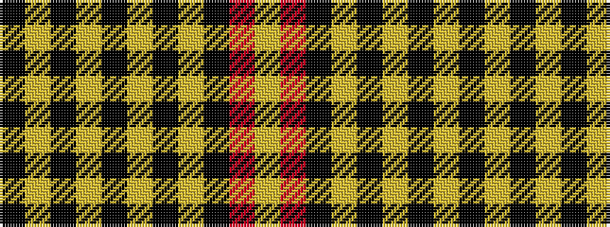

KYKYKYKYKRY

It is a 11 stripe tartan.

<figure class="pat-woven">

<figcaption>idealised sample</figcaption>
</figure>

## Colour Sequence



## Tartans with this colour sequence

| Tartans |
|---------------|
| [Wcwm 9285 4906-1](/variants/s11/k12lr4k4lr4k4lr10k4lr3k8r24lr2~x2/)|
||
