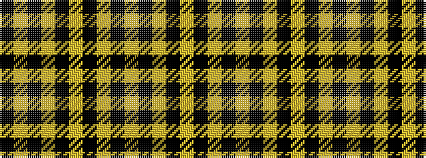

KYKYKYKYKYKYKY

It is a 14 stripe tartan.

<figure class="pat-woven">

<figcaption>idealised sample</figcaption>
</figure>

## Colour Sequence



## Tartans with this colour sequence

| Tartans |
|---------------|
| [Justus Yellow & Black (Personal)](/variants/s14/ly20k19ly8k3ly3k3ly3k40ly5k10ly15k40ly3k3~x2/)|
||
