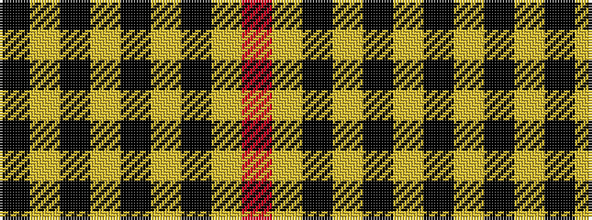

KYKYKYKYR

It is a 9 stripe tartan.

<figure class="pat-woven">

<figcaption>idealised sample</figcaption>
</figure>

## Colour Sequence



## Tartans with this colour sequence

| Tartans |
|---------------|
| [MacKnight (Name)](/variants/s9/k12lr1k2lr6k4lr3k4lr21r4~x2/)|
||
