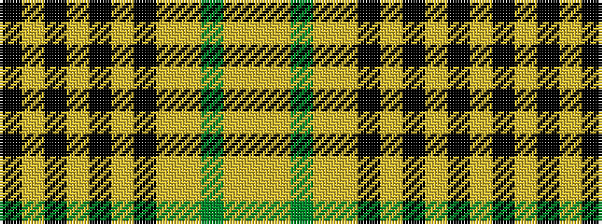

KYKYKYKYYGYY

It is a 12 stripe tartan.

<figure class="pat-woven">

<figcaption>idealised sample</figcaption>
</figure>

## Colour Sequence



## Tartans with this colour sequence

| Tartans |
|---------------|
| [Kinloch Anderson Check Fashion Tartan Tartan Number: 3003. Earliest known date: 2002 Designed by Douglas Kinloch Anderson for his Japanese & Korean markets. The use of the word 'Check' indicates that they regard it as a 'fashion tartan'. See products available Copyright © Blair Urquhart, Comrie, 2015](/setts/s12/k18lo2k2lo3k2lo2k18lo12ly18dy3ly18lo9~x2/)|
||
