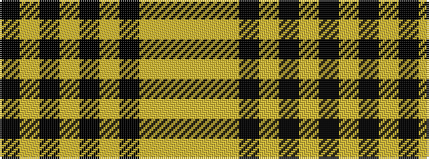

KYKYKYKYYY

It is a 10 stripe tartan.

<figure class="pat-woven">

<figcaption>idealised sample</figcaption>
</figure>

## Colour Sequence



## Tartans with this colour sequence

| Tartans |
|---------------|
| [Hannay Dress (Dance)](/variants/s10/k9lr4k2lr4k2lr29k9lr4lg14ly2~x2/)|
||
