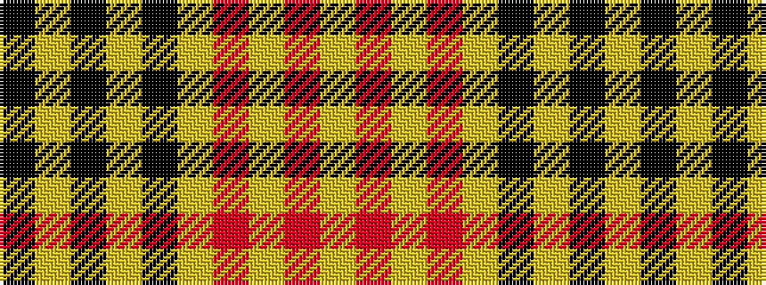

KYKYKYRYRY

It is a 10 stripe tartan.

<figure class="pat-woven">

<figcaption>idealised sample</figcaption>
</figure>

## Colour Sequence



## Tartans with this colour sequence

| Tartans |
|---------------|
| [Intergen](/variants/s10/lg33r1lg4r1lg33k30ly3k4ly3k30~x2/)|
||
