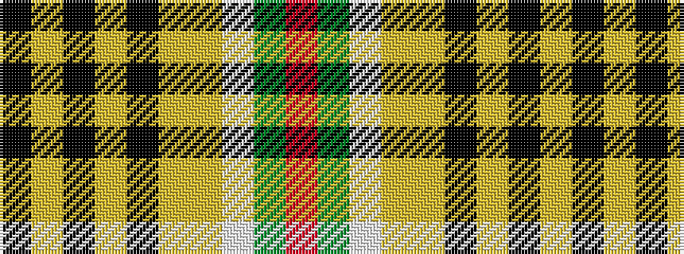

KYKYKYYWGR

It is a 10 stripe tartan.

<figure class="pat-woven">

<figcaption>idealised sample</figcaption>
</figure>

## Colour Sequence



## Tartans with this colour sequence

| Tartans |
|---------------|
| [Spotsylvania County Sheriff's Office](/variants/s10/k2ly2k24ly2k2ly2lo30w3g2r2~x2/)|
||
