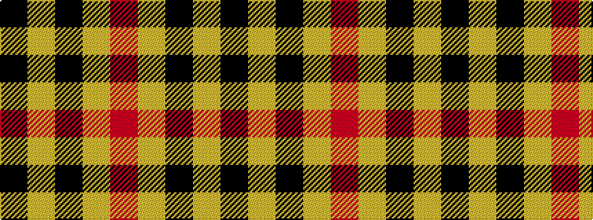

KYKYR

It is a 5 stripe tartan.

<figure class="pat-woven">

<figcaption>idealised sample</figcaption>
</figure>

## Colour Sequence



## Tartans with this colour sequence

| Tartans |
|---------------|
| [MacLeod Dress Clan Tartan](/variants/s5/k4ly1k4ly6r1~x4/)|
||
| [MacLeod of Lewis](/setts/k8ly1k8ly12r1/)|
||
