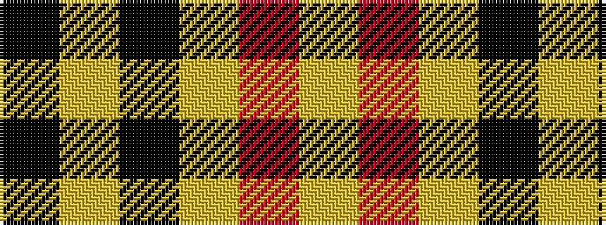

KYKYRY

It is a 6 stripe tartan.

<figure class="pat-woven">

<figcaption>idealised sample</figcaption>
</figure>

## Colour Sequence



## Tartans with this colour sequence

| Tartans |
|---------------|
| [Intergen (Corporate)](/setts/s6/k4lg3k30lg33r1lg4~x2/)|
||
| [MacLeod #3](/setts/s6/k6ly1k6ly9r1ly2~x2/)|
||
