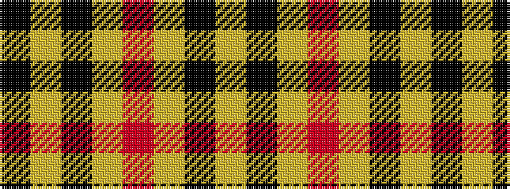

KYKYRYKY

It is a 8 stripe tartan.

<figure class="pat-woven">

<figcaption>idealised sample</figcaption>
</figure>

## Colour Sequence



## Tartans with this colour sequence

| Tartans |
|---------------|
| [Clyde Valley HOG](/setts/s8/k54lr6k6lr6o20lo40k6ly3/)|
||
