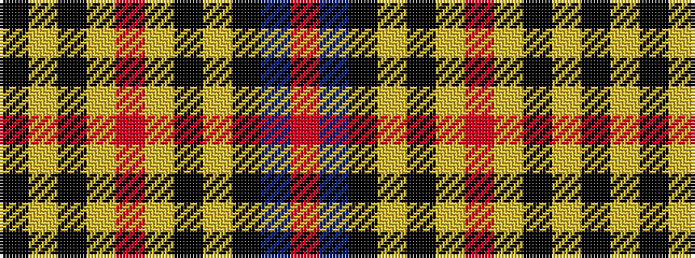

KYKYRYKYKBR

It is a 11 stripe tartan.

<figure class="pat-woven">

<figcaption>idealised sample</figcaption>
</figure>

## Colour Sequence



## Tartans with this colour sequence

| Tartans |
|---------------|
| [Merchiston Castle School](/tartans/k18lr8k8lr8r5lr18k5lr5k12db36r5/)|
||
