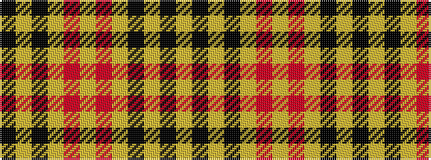

KYKYRYRYKYKY

It is a 12 stripe tartan.

<figure class="pat-woven">

<figcaption>idealised sample</figcaption>
</figure>

## Colour Sequence



## Tartans with this colour sequence

| Tartans |
|---------------|
| [Baillieville Family Tartan](/variants/s12/k4ly1k4ly11r1ly1r1ly11k4ly1k4ly1~x4/)|
||
