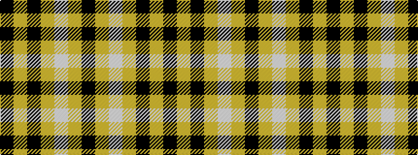

KYKYWYK

It is a 7 stripe tartan.

<figure class="pat-woven">

<figcaption>idealised sample</figcaption>
</figure>

## Colour Sequence



## Tartans with this colour sequence

| Tartans |
|---------------|
| [Gleneagles Gold (Dalgleish)](/variants/s7/k4lo4lb32lo1k32lo4k2~x4/)|
||
