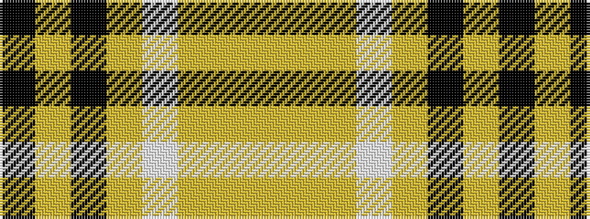

KYKYWYYY

It is a 8 stripe tartan.

<figure class="pat-woven">

<figcaption>idealised sample</figcaption>
</figure>

## Colour Sequence



## Tartans with this colour sequence

| Tartans |
|---------------|
| [Bannockbane Light Tan](/setts/s8/k4ly2k13ly1w8lo13ly2lo4~x2/)|
||
