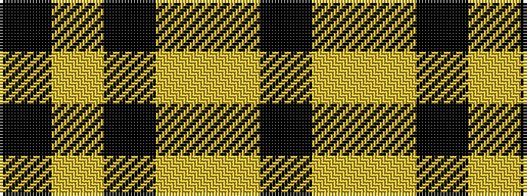

KYKYYK

It is a 6 stripe tartan.

<figure class="pat-woven">

<figcaption>idealised sample</figcaption>
</figure>

## Colour Sequence



## Tartans with this colour sequence

| Tartans |
|---------------|
| [Merola (2016)](/variants/s6/k36ly5k1ly1lr5k12~x2/)|
||
