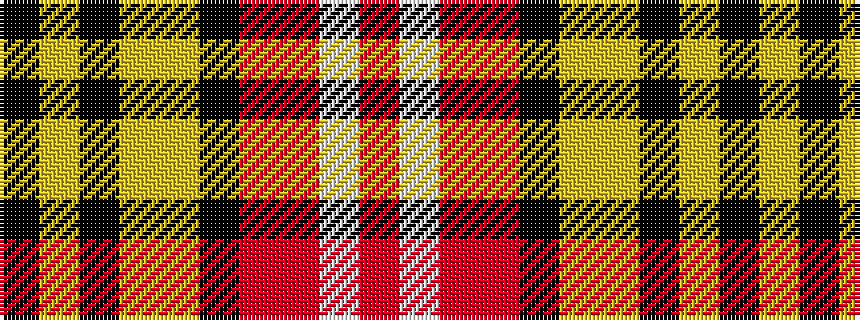

KYKYYKRRWR

It is a 10 stripe tartan.

<figure class="pat-woven">

<figcaption>idealised sample</figcaption>
</figure>

## Colour Sequence



## Tartans with this colour sequence

| Tartans |
|---------------|
| [Walls, Steve C (Personal)](/setts/s10/k3ly2k2ly14lo3k6ri8r14w2r3~x2/)|
||
