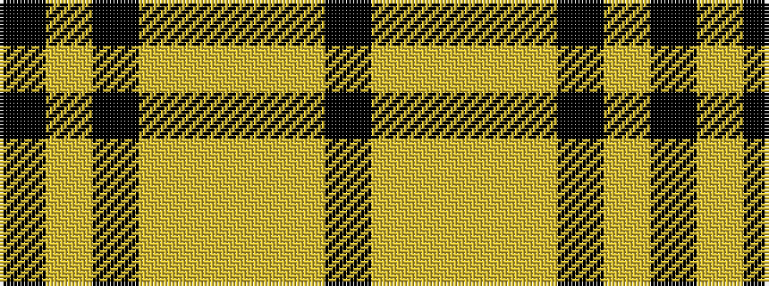

KYKYYYYK

It is a 8 stripe tartan.

<figure class="pat-woven">

<figcaption>idealised sample</figcaption>
</figure>

## Colour Sequence



## Tartans with this colour sequence

| Tartans |
|---------------|
| [Longford County Crest (Fashion)](/setts/s8/k44lo9k3lo8lo16lo15lo6k7~x2/)|
||
