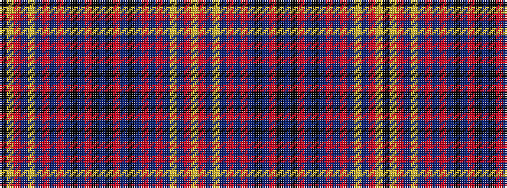

KYRBYBRBRBKBRKBKRBKBRBRBYBRY

It is a 28 stripe tartan.

<figure class="pat-woven">

<figcaption>idealised sample</figcaption>
</figure>

## Colour Sequence



## Tartans with this colour sequence

| Tartans |
|---------------|
| [James of Wales](/setts/s28/db11k1r3db6k1db6r3db4r7db11lo1db11r7lo2k4/)|
||
