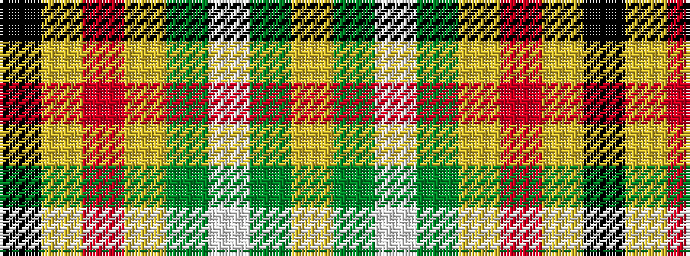

KYRYGWGY

It is a 8 stripe tartan.

<figure class="pat-woven">

<figcaption>idealised sample</figcaption>
</figure>

## Colour Sequence



## Tartans with this colour sequence

| Tartans |
|---------------|
| [Hackett William (Coatbridge) Hunting (Personal)](/setts/s8/k20ly4r4ly20g20w5g2lg2~x2/)|
||
