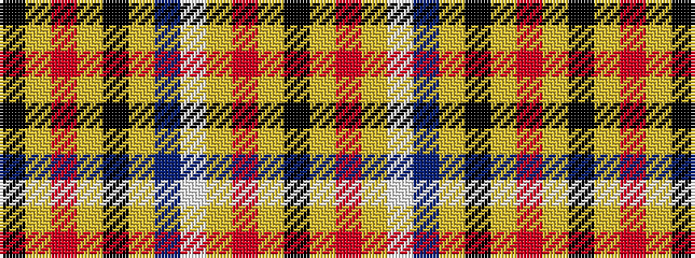

KYRYKYBWYRYK

It is a 12 stripe tartan.

<figure class="pat-woven">

<figcaption>idealised sample</figcaption>
</figure>

## Colour Sequence



## Tartans with this colour sequence

| Tartans |
|---------------|
| [McMillen Memorial, Hugh E. (Personal](/variants/s12/k8ly2o18ly3k8ly18dp4w3ly12r1ly2k2~x2/)|
||
