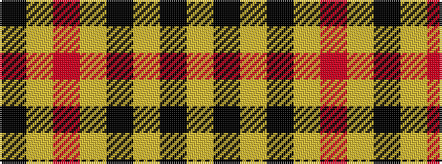

KYRYKYKY

It is a 8 stripe tartan.

<figure class="pat-woven">

<figcaption>idealised sample</figcaption>
</figure>

## Colour Sequence



## Tartans with this colour sequence

| Tartans |
|---------------|
| [Wilbers](/variants/s8/ly5k9ly2k7lo35r4lo35k4~x2/)|
||
