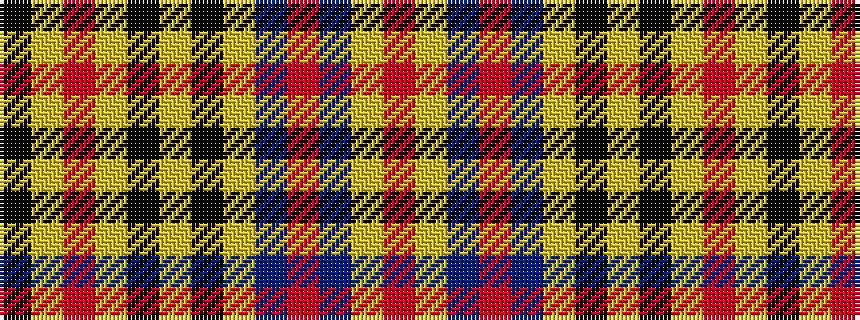

KYRYKYKYBRBYR

It is a 13 stripe tartan.

<figure class="pat-woven">

<figcaption>idealised sample</figcaption>
</figure>

## Colour Sequence



## Tartans with this colour sequence

| Tartans |
|---------------|
| [Bartlett (Personal)](/setts/s13/r4lo40n12o2n12lo30k2lo4k2lo4o2lo3k3~x2/)|
||
