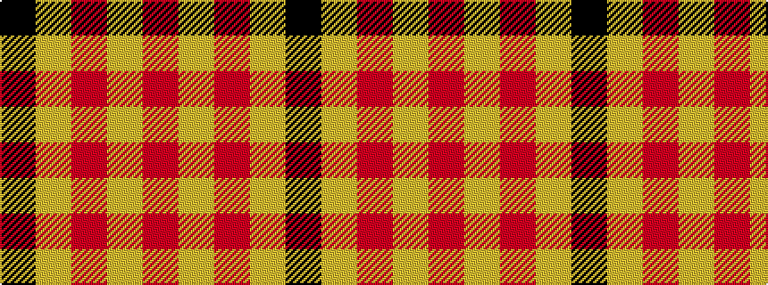

KYRYR

It is a 5 stripe tartan.

<figure class="pat-woven">

<figcaption>idealised sample</figcaption>
</figure>

## Colour Sequence



## Tartans with this colour sequence

| Tartans |
|---------------|
| [Shire of Hornwood (USA)](/variants/s5/r18ly3r18ly30k4~x2/)|
||
