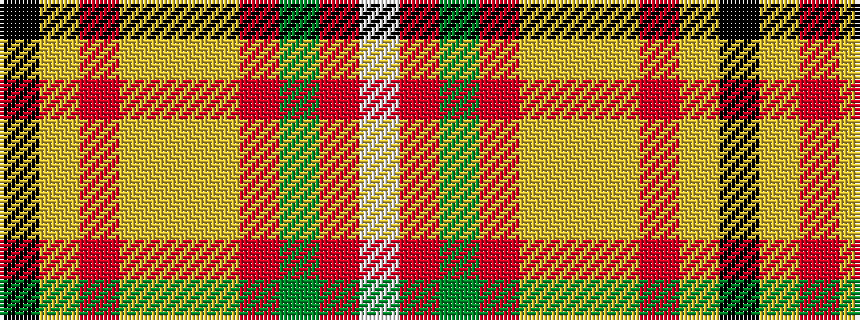

KYRYYYRGRW

It is a 10 stripe tartan.

<figure class="pat-woven">

<figcaption>idealised sample</figcaption>
</figure>

## Colour Sequence



## Tartans with this colour sequence

| Tartans |
|---------------|
| [Hello Kitty](/setts/s10/k2lr3r3lr21ly3lr2r6g6r4w2~x2/)|
||
