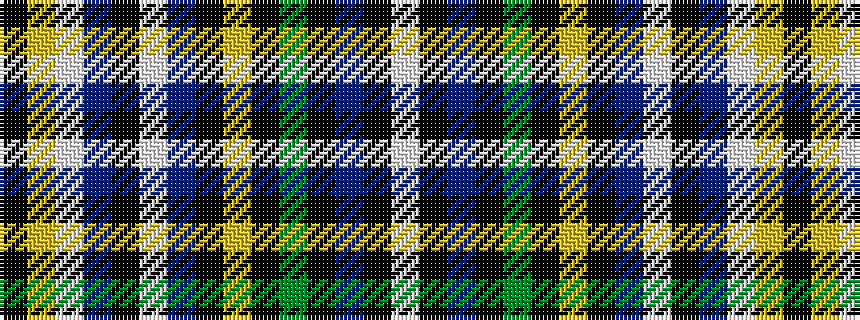

KYWBKWBKYKGKBKW

It is a 15 stripe tartan.

<figure class="pat-woven">

<figcaption>idealised sample</figcaption>
</figure>

## Colour Sequence



## Tartans with this colour sequence

| Tartans |
|---------------|
| [House of Holland (Fashion)](/setts/s15/lb5k1p5k1g4k1ly4k1p30lp1k2p1lb1ly1k1~x2/)|
||
