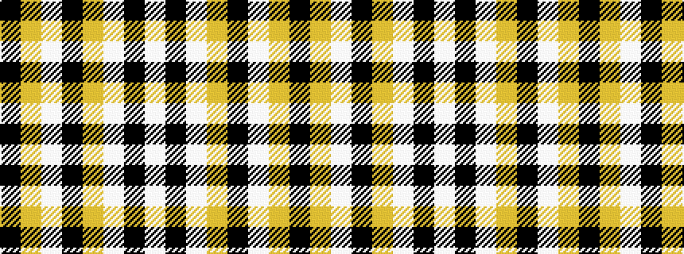

KYWKYWKW

It is a 8 stripe tartan.

<figure class="pat-woven">

<figcaption>idealised sample</figcaption>
</figure>

## Colour Sequence



## Tartans with this colour sequence

| Tartans |
|---------------|
| [Guzzo Dress (Montreal, Canada) (Personal)](/variants/s8/w20k2w20ly5k3w3ly4k2/)|
||
| [Guzzo Dress (Personal)](/variants/s8/w20k2w20lo5k3w3lo4k2/)|
||
