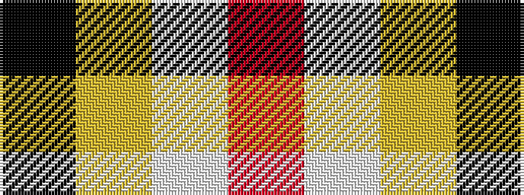

KYWR

It is a 4 stripe tartan.

<figure class="pat-woven">

<figcaption>idealised sample</figcaption>
</figure>

## Colour Sequence



## Tartans with this colour sequence

| Tartans |
|---------------|
| [Klymson (Chicago) (Personal)](/variants/s4/k70lo16lt3r45/)|
||
| [Spirit of Riverside (Corporate)](/variants/s4/o20w13ly24k3~x2/)|
||
