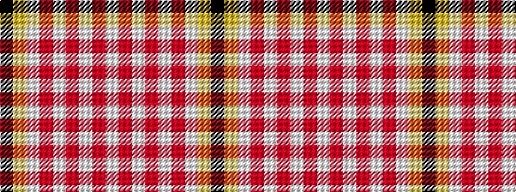

KYWRWRWRW

It is a 9 stripe tartan.

<figure class="pat-woven">

<figcaption>idealised sample</figcaption>
</figure>

## Colour Sequence



## Tartans with this colour sequence

| Tartans |
|---------------|
| [Fueglistal](/variants/s9/k3lo6lb13r2lb2r32lb1r2lb1~x2/)|
||
