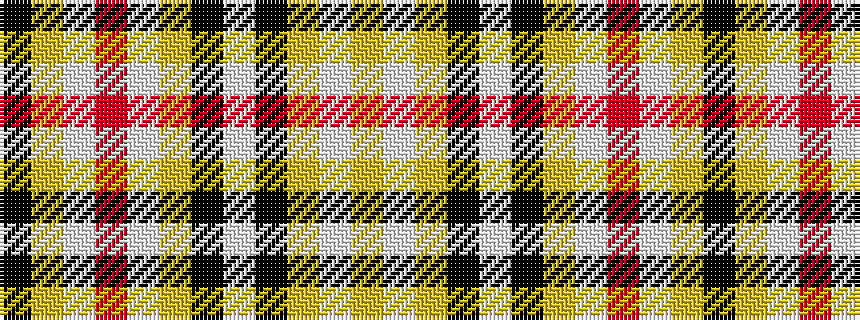

KYWRWYKWKYWY

It is a 12 stripe tartan.

<figure class="pat-woven">

<figcaption>idealised sample</figcaption>
</figure>

## Colour Sequence



## Tartans with this colour sequence

| Tartans |
|---------------|
| [Unidentified (GMG 2002)](/setts/s12/lo10w1lo12k7w2k7lo12w1r4w1lo12k2~x2/)|
||
